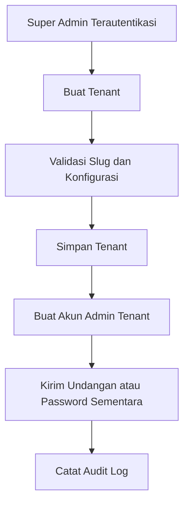
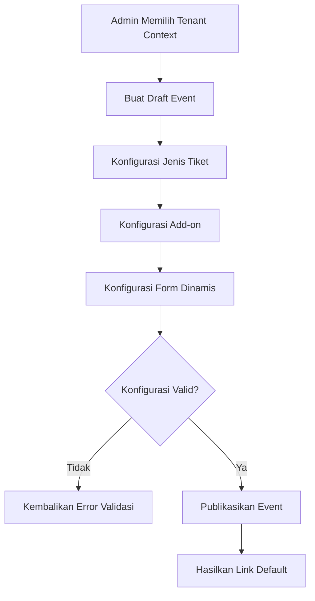
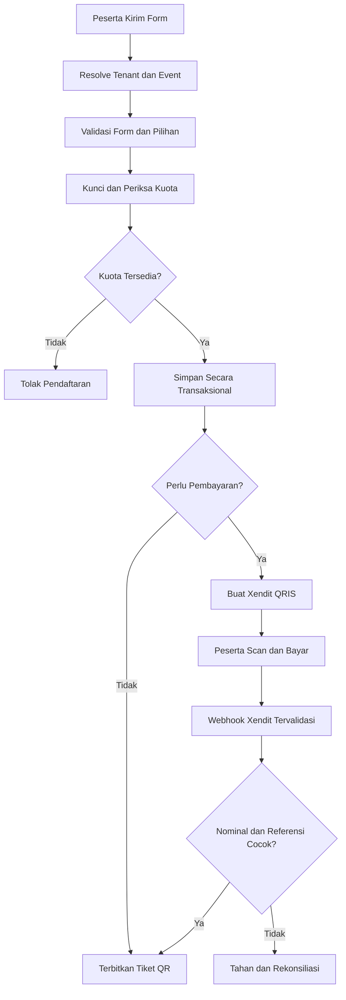
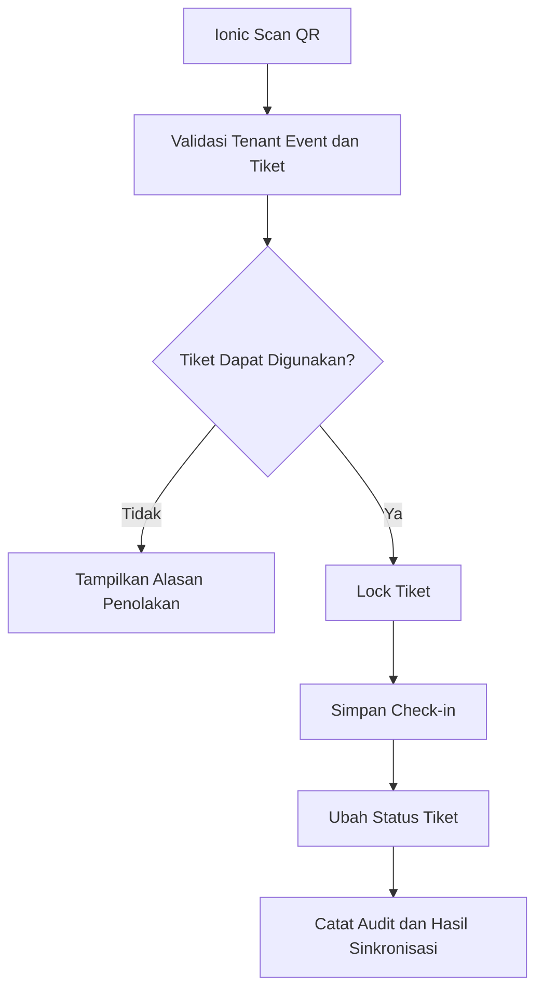
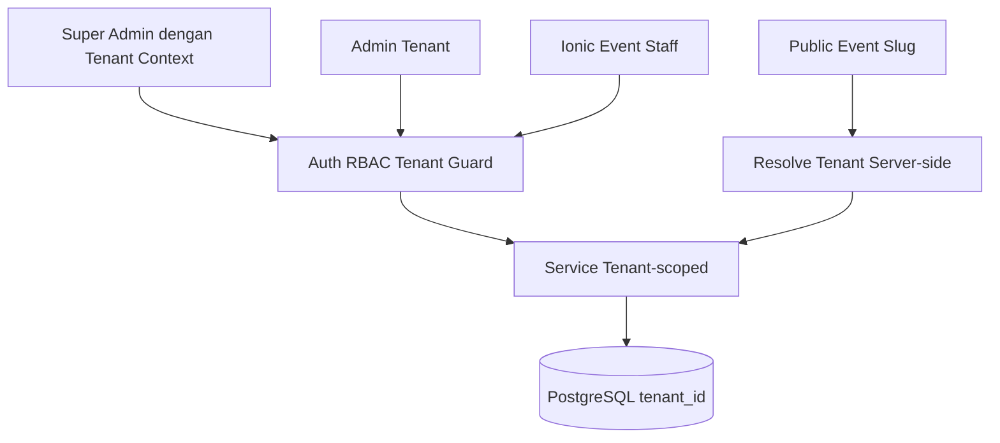

# Prompt Implementasi Backend Web Ticketing Multitenant

Gunakan prompt berikut untuk membangun backend aplikasi.

## Prompt

Anda adalah senior backend engineer dan database architect. Bangun backend REST API untuk **Web Ticketing Multitenant** yang akan digunakan oleh frontend Next.js dan aplikasi Ionic React. Sistem harus aman, production-ready, terdokumentasi, mudah diuji, dan memiliki isolasi tenant yang kuat.

### 1. Teknologi dan prinsip arsitektur

- Gunakan NestJS + TypeScript.
- Gunakan PostgreSQL sebagai database utama.
- Gunakan Prisma ORM dan migration yang dapat direproduksi.
- Gunakan Redis untuk rate limit, cache, distributed lock, queue, dan idempotency jika tersedia.
- Gunakan object storage kompatibel S3 untuk banner, logo, dan upload field.
- Gunakan Xendit Payments API v3 untuk pembayaran satu kali dengan QRIS sebagai channel utama.
- Gunakan REST API dengan OpenAPI/Swagger.
- Semua nama tabel dan kolom database wajib huruf kecil.
- Gunakan `snake_case` untuk nama yang terdiri dari lebih dari satu kata, misalnya `tenant_users`, `ticket_types`, `registration_answers`, dan `created_at`.
- Nama model TypeScript boleh mengikuti konvensi bahasa, tetapi mapping database harus eksplisit ke nama `snake_case`.
- Gunakan UUID untuk primary key dan timestamp timezone-aware.
- Gunakan soft delete pada data master penting melalui `deleted_at`, tanpa menghapus data transaksi secara fisik.

### 2. Model multitenancy

Gunakan **shared database, shared schema, tenant discriminator**:

- Semua tabel milik tenant memiliki kolom `tenant_id` wajib.
- `tenant_id` berasal dari token/session pengguna untuk endpoint privat, bukan dipercaya dari request body.
- Super Admin harus memilih tenant context secara eksplisit untuk operasi tenant dan setiap perpindahan context dicatat.
- Public endpoint memperoleh tenant dari kombinasi `tenant_slug` dan `event_slug`, lalu backend menetapkan `tenant_id` sendiri.
- Setiap query, update, delete, aggregate, export, cache key, queue job, dan file path wajib terikat tenant.
- Tambahkan PostgreSQL Row Level Security sebagai defense-in-depth bila sesuai dengan koneksi aplikasi. Tetap lakukan filter tenant pada application layer.
- Buat composite unique index yang menyertakan `tenant_id` untuk key yang hanya unik per tenant.
- Dilarang menerima `tenant_id` bebas dari Admin Tenant.

### 3. Role dan izin

Role minimum:

- `super_admin`: akses global, CRUD tenant, membuat akun tenant, dan dapat mengelola resource tenant setelah memilih tenant context.
- `tenant_admin`: akses penuh hanya pada tenant yang ditetapkan.
- `event_staff`: opsional, hanya melihat peserta dan melakukan check-in pada event yang diberikan.

Gunakan RBAC guard dan permission policy per resource/action. Verifikasi role, status akun, status tenant, kepemilikan tenant, serta assignment event pada setiap request.

### 4. Struktur tabel minimum

Buat migration, foreign key, index, constraint, dan seed untuk tabel berikut.

#### Identitas dan tenant

```text
users
- id
- full_name
- email
- whatsapp_number
- password_hash
- is_super_admin
- status
- last_login_at
- created_at
- updated_at
- deleted_at

tenants
- id
- name
- slug
- logo_url
- primary_color
- email
- whatsapp_number
- address
- custom_domain
- status
- settings_json
- created_at
- updated_at
- deleted_at

tenant_users
- id
- tenant_id
- user_id
- role
- status
- created_by
- created_at
- updated_at
- deleted_at
```

Constraint penting: `users.email` unik secara case-insensitive, `tenants.slug` unik, dan pasangan `tenant_users.tenant_id + tenant_users.user_id` unik untuk data aktif.

#### Event

```text
events
- id
- tenant_id
- name
- slug
- short_description
- description
- banner_url
- location_type
- location_name
- location_address
- meeting_url
- start_at
- end_at
- timezone
- registration_start_at
- registration_end_at
- capacity
- organizer_name
- organizer_contact
- terms_text
- privacy_text
- status
- published_at
- created_by
- updated_by
- created_at
- updated_at
- deleted_at
```

Pasangan `tenant_id + slug` harus unik untuk data aktif. Validasi tanggal event dan periode pendaftaran secara konsisten.

#### Jenis tiket dan add-on

```text
ticket_types
- id
- tenant_id
- event_id
- name
- slug
- description
- price
- currency
- quota
- min_per_order
- max_per_order
- sale_start_at
- sale_end_at
- visibility
- access_code_hash
- sort_order
- is_active
- created_at
- updated_at
- deleted_at

add_ons
- id
- tenant_id
- event_id
- name
- slug
- description
- price
- currency
- quota
- selection_type
- min_quantity
- max_quantity
- is_required
- sort_order
- is_active
- created_at
- updated_at
- deleted_at

add_on_options
- id
- tenant_id
- add_on_id
- label
- value
- price_adjustment
- quota
- sort_order
- is_active
- created_at
- updated_at
- deleted_at

ticket_type_add_ons
- id
- tenant_id
- ticket_type_id
- add_on_id
- created_at
```

Gunakan tipe numeric/decimal untuk uang, jangan floating point.

#### Form dinamis

```text
form_fields
- id
- tenant_id
- event_id
- ticket_type_id nullable
- field_key
- label
- field_type
- placeholder
- help_text
- default_value_json
- validation_json
- conditional_logic_json
- sort_order
- is_required
- is_system
- is_active
- created_at
- updated_at
- deleted_at

form_field_options
- id
- tenant_id
- form_field_id
- label
- value
- sort_order
- is_active
- created_at
- updated_at
- deleted_at
```

Field sistem `full_name`, `whatsapp_number`, dan `email` dibuat otomatis untuk setiap event, wajib aktif, dan tidak dapat dihapus. Validasi `field_key` dengan pola `snake_case`. Conditional logic disimpan sebagai struktur JSON terkontrol, bukan kode yang dieksekusi.

#### Pendaftaran dan tiket

```text
registrations
- id
- tenant_id
- event_id
- registration_code
- full_name
- whatsapp_number
- email
- status
- subtotal_amount
- add_on_amount
- total_amount
- currency
- idempotency_key
- source
- registered_at
- created_at
- updated_at
- cancelled_at

registration_items
- id
- tenant_id
- registration_id
- ticket_type_id
- quantity
- unit_price
- total_price
- created_at

registration_add_ons
- id
- tenant_id
- registration_id
- add_on_id
- add_on_option_id nullable
- quantity
- unit_price
- total_price
- created_at

registration_answers
- id
- tenant_id
- registration_id
- form_field_id
- answer_json
- created_at
- updated_at

tickets
- id
- tenant_id
- event_id
- registration_id
- registration_item_id
- ticket_code
- qr_token_hash
- holder_name
- holder_email
- status
- issued_at
- cancelled_at
- created_at
- updated_at

check_ins
- id
- tenant_id
- event_id
- ticket_id
- checked_in_by
- checked_in_at
- source
- device_id
- sync_key
- notes
- voided_at
- voided_by
- created_at
```

Simpan hash token QR, bukan rahasia mentah. `ticket_code` unik secara global atau gunakan constraint unik yang aman. Cegah lebih dari satu check-in aktif per tiket melalui constraint/index dan transaksi.

#### Konfigurasi Xendit, pembayaran, webhook, dan audit

```text
payment_configs
- id
- tenant_id nullable
- provider
- account_mode
- environment
- business_id
- secret_api_key_encrypted
- webhook_token_encrypted
- api_version
- is_default
- is_active
- verified_at
- created_at
- updated_at
- deleted_at

payments
- id
- tenant_id
- registration_id
- provider
- payment_method
- reference_id
- provider_payment_request_id
- provider_payment_id nullable
- provider_business_id nullable
- amount
- currency
- status
- failure_code nullable
- qr_string_encrypted nullable
- qr_expires_at nullable
- provider_created_at nullable
- paid_at
- expired_at
- last_checked_at
- created_at
- updated_at

payment_webhook_events
- id
- tenant_id nullable
- provider
- event_name
- provider_event_key
- provider_payment_id nullable
- provider_payment_request_id nullable
- reference_id nullable
- payload_json
- headers_json_masked
- status
- processing_error nullable
- received_at
- processed_at nullable
- created_at

audit_logs
- id
- tenant_id nullable
- actor_user_id
- actor_role
- action
- entity_type
- entity_id
- before_json
- after_json
- ip_address
- user_agent
- created_at
```

Gunakan satu akun Xendit platform sebagai default dan izinkan konfigurasi akun Xendit khusus per tenant bila diperlukan. Secret API key dan webhook token wajib dienkripsi menggunakan application key/KMS dan hanya dapat ditulis atau dirotasi, tidak pernah dikembalikan melalui API. `tenant_id` pada konfigurasi platform default boleh `null`, tetapi setiap transaksi pembayaran tetap wajib mempunyai `tenant_id`.

Pendaftaran gratis dapat langsung menghasilkan tiket. Pendaftaran berbayar wajib menggunakan Xendit QRIS dan baru menerbitkan tiket setelah webhook Xendit tervalidasi. Jangan memakai endpoint legacy `/qr_codes`; gunakan `POST /v3/payment_requests` dengan `type: PAY`, `country: ID`, `currency: IDR`, dan `channel_code: QRIS`.

### 5. Status dan aturan domain

Definisikan enum/application constants yang tervalidasi:

- tenant: `active`, `inactive`, `suspended`;
- user: `active`, `inactive`, `invited`, `locked`;
- event: `draft`, `published`, `closed`, `archived`;
- registration: `pending`, `pending_payment`, `confirmed`, `cancelled`, `expired`, `rejected`;
- payment: `pending`, `requires_action`, `succeeded`, `failed`, `expired`, `refunded`, `partially_refunded`;
- ticket: `issued`, `checked_in`, `cancelled`, `expired`;
- visibility: `public`, `hidden`, `access_code`.

Aturan utama:

- Event hanya dapat didaftarkan jika tenant aktif, event `published`, dan periode pendaftaran terbuka.
- Kuota event, jenis tiket, add-on, dan opsi add-on diperiksa ulang di dalam transaksi database.
- Harga selalu dihitung ulang dari database, tidak mempercayai nominal dari frontend.
- Penerbitan tiket harus idempotent.
- Status registration berbayar hanya berubah menjadi `confirmed` setelah payment internal menjadi `succeeded` melalui webhook tervalidasi atau rekonsiliasi server-to-server yang sah.
- Satu `idempotency_key` hanya boleh menghasilkan satu registration dalam scope yang benar.
- Perubahan form setelah event menerima pendaftar tidak boleh merusak jawaban lama; gunakan snapshot label/opsi jika dibutuhkan.
- Audit perubahan tenant, user, event, harga, kuota, form, status registration, penerbitan tiket, dan check-in.

### 6. Endpoint REST minimum

Gunakan prefix `/api/v1`.

#### Authentication

```text
POST   /auth/login
POST   /auth/refresh
POST   /auth/logout
POST   /auth/forgot-password
POST   /auth/reset-password
GET    /auth/me
POST   /auth/tenant-context
```

Gunakan access token berumur pendek dan refresh token rotation yang aman. Untuk web, prioritaskan cookie `httpOnly`, `secure`, dan `sameSite`; untuk Ionic gunakan secure storage dan flow token yang sesuai perangkat.

#### Super Admin

```text
GET    /tenants
POST   /tenants
GET    /tenants/:tenant_id
PATCH  /tenants/:tenant_id
POST   /tenants/:tenant_id/users
GET    /tenants/:tenant_id/users
PATCH  /tenants/:tenant_id/users/:tenant_user_id
POST   /tenants/:tenant_id/users/:tenant_user_id/reset-password
GET    /tenants/:tenant_id/payment-config
PUT    /tenants/:tenant_id/payment-config
POST   /tenants/:tenant_id/payment-config/test
```

#### Event dan konfigurasi tenant

```text
GET    /events
POST   /events
GET    /events/:event_id
PATCH  /events/:event_id
POST   /events/:event_id/publish
POST   /events/:event_id/close
GET    /events/:event_id/public-link

GET    /events/:event_id/ticket-types
POST   /events/:event_id/ticket-types
PATCH  /events/:event_id/ticket-types/:ticket_type_id
DELETE /events/:event_id/ticket-types/:ticket_type_id

GET    /events/:event_id/add-ons
POST   /events/:event_id/add-ons
PATCH  /events/:event_id/add-ons/:add_on_id
DELETE /events/:event_id/add-ons/:add_on_id

GET    /events/:event_id/form-fields
POST   /events/:event_id/form-fields
PATCH  /events/:event_id/form-fields/:form_field_id
DELETE /events/:event_id/form-fields/:form_field_id
PUT    /events/:event_id/form-fields/reorder
```

#### Public registration

```text
GET    /public/events/:tenant_slug/:event_slug
GET    /public/events/:tenant_slug/:event_slug/form
GET    /public/events/:tenant_slug/:event_slug/availability
POST   /public/events/:tenant_slug/:event_slug/registrations
POST   /public/registrations/:registration_code/payments/qris
GET    /public/registrations/:registration_code/payment-status
POST   /public/registrations/:registration_code/payments/retry
GET    /public/tickets/:ticket_code
```

Endpoint pendaftaran menerima `Idempotency-Key` header. Jangan bocorkan data peserta lain melalui public ticket lookup; gunakan token tambahan atau data yang dimasking.

#### Operasional

```text
GET    /events/:event_id/registrations
GET    /events/:event_id/registrations/:registration_id
PATCH  /events/:event_id/registrations/:registration_id/status
POST   /events/:event_id/registrations/:registration_id/issue-tickets
GET    /events/:event_id/tickets
POST   /events/:event_id/check-ins/validate
POST   /events/:event_id/check-ins
POST   /events/:event_id/check-ins/:check_in_id/void
POST   /events/:event_id/check-ins/sync
GET    /events/:event_id/reports/summary
GET    /events/:event_id/reports/export
GET    /events/:event_id/payments
POST   /events/:event_id/payments/:payment_id/reconcile
```

Endpoint webhook publik yang diterima langsung dari Xendit:

```text
POST   /api/v1/webhooks/xendit/payments
```

### 7. Pendaftaran transaksional

Implementasikan proses berikut dalam service domain:

1. Resolve tenant dan event dari slug.
2. Validasi tenant, event, periode, access code, dan idempotency key.
3. Validasi payload terhadap konfigurasi form aktif dari database.
4. Validasi jenis tiket, add-on, opsi, relasi, batas jumlah, dan kuota.
5. Lock/cadangkan kuota secara atomik untuk mencegah overselling.
6. Hitung harga dan total dari database.
7. Simpan registration, item, add-on, dan jawaban dalam satu transaksi.
8. Untuk total nol, konfirmasi dan terbitkan tiket secara idempotent.
9. Untuk total lebih dari nol, buat payment internal lalu buat Xendit Payment Request QRIS.
10. Queue notifikasi email/WhatsApp tanpa menahan response utama.

Validasi jawaban dinamis berdasarkan tipe field, required, pilihan yang tersedia, ukuran, pola, rentang angka/tanggal, serta conditional logic yang diizinkan.

### 8. Integrasi Xendit QRIS dan webhook otomatis

#### Membuat pembayaran QRIS

Gunakan server-to-server request:

```text
POST https://api.xendit.co/v3/payment_requests
Authorization: Basic {base64(secret_api_key + ":")}
api-version: 2024-11-11
Content-Type: application/json
```

Payload minimum yang dibentuk backend:

```json
{
  "reference_id": "payment_reference_unik",
  "type": "PAY",
  "country": "ID",
  "currency": "IDR",
  "request_amount": 150000,
  "capture_method": "AUTOMATIC",
  "channel_code": "QRIS",
  "description": "Tiket Event - REG-XXXX",
  "metadata": {
    "registration_code": "REG-XXXX",
    "tenant_reference": "tenant_reference_aman",
    "event_reference": "event_reference_aman"
  }
}
```

- Gunakan `reference_id` unik dan stabil dari payment internal, bukan email/nomor WhatsApp.
- Kirim header idempotensi jika didukung oleh versi endpoint/SDK yang digunakan; tetap terapkan unique constraint dan idempotensi internal.
- Jangan mengirim `tenant_id` sebagai sumber otorisasi. Metadata hanya untuk korelasi dan wajib dicocokkan dengan record internal.
- Ambil nilai QR dari `actions[]` dengan action `PRESENT_TO_CUSTOMER` dan descriptor QR string yang dikembalikan Xendit, lalu normalisasikan untuk frontend.
- Simpan provider ID, status, expiry, dan QR seperlunya. QR string diperlakukan sebagai data sensitif berumur pendek, dienkripsi saat disimpan, dan dibersihkan setelah kedaluwarsa sesuai retention policy.
- Batas minimum/maksimum dan expiry mengikuti konfigurasi channel QRIS aktif pada Xendit. Jangan hard-code batas bisnis tanpa validasi konfigurasi.
- API key hanya digunakan di backend. Pisahkan key test dan live dan cegah key test dipakai di production.

#### Webhook otomatis

Daftarkan URL HTTPS berikut pada menu webhook Xendit untuk Payment Status:

```text
https://{api_domain}/api/v1/webhooks/xendit/payments
```

Handler wajib:

1. Membaca raw body sebelum transformasi DTO bila diperlukan untuk audit aman.
2. Memverifikasi header `x-callback-token` menggunakan constant-time comparison terhadap webhook token terenkripsi yang sesuai akun Xendit.
3. Menolak request tanpa token valid dengan `401` atau `403` tanpa memproses transaksi.
4. Mengenali event Payments API seperti `payment.capture`, `payment.failure`, dan event expiry yang tersedia pada konfigurasi Xendit.
5. Membentuk `provider_event_key` unik dari event, `payment_id`, `capture_id` bila tersedia, status, dan timestamp/provider identifier yang stabil.
6. Menyimpan event terlebih dahulu pada `payment_webhook_events`; unique constraint mencegah pemrosesan ganda.
7. Mengembalikan respons `2xx` dengan cepat setelah event tervalidasi dan tersimpan, kemudian memproses business logic melalui queue.
8. Resolve payment menggunakan `payment_request_id`, `payment_id`, dan `reference_id`, lalu cocokkan `business_id`, amount, currency, serta tenant scope terhadap record internal.
9. Untuk pembayaran sukses, lakukan transaksi database: ubah payment menjadi `succeeded`, registration menjadi `confirmed`, konsumsi/resmikan reservasi kuota, terbitkan tiket secara idempoten, dan enqueue notifikasi.
10. Untuk gagal atau kedaluwarsa, ubah status secara monotonic, lepaskan reservasi kuota sesuai aturan, dan izinkan retry yang membuat payment baru tanpa menimpa riwayat lama.
11. Jangan menurunkan status final `succeeded` hanya karena webhook lama, gagal, atau out-of-order datang belakangan.
12. Simpan alasan kegagalan pemrosesan dan sediakan worker retry/dead-letter queue serta aksi rekonsiliasi manual berizin.

Jangan menerbitkan tiket berdasarkan return URL, polling frontend, screenshot pembayaran, atau status yang dikirim peserta. Webhook diproses sepenuhnya di server. Xendit dapat mengirim webhook duplikat, melakukan retry, dan mengirim event tidak berurutan; seluruh handler harus idempoten dan order-independent.

#### Rekonsiliasi

- Sediakan scheduled job untuk memeriksa payment `pending` yang melewati interval tertentu melalui API Xendit menggunakan provider ID.
- Rekonsiliasi tidak boleh menggandakan tiket atau check-in.
- Catat perbedaan amount, currency, business ID, dan status sebagai security incident; jangan otomatis mengonfirmasi transaksi yang tidak cocok.
- Dashboard menampilkan webhook terakhir, jumlah retry, payment orphan, dan transaksi yang membutuhkan pemeriksaan.

### 9. QR tiket dan check-in Ionic

- QR berisi signed opaque token atau URL pendek; jangan memuat data pribadi.
- Endpoint validasi mengembalikan status tiket tanpa melakukan check-in.
- Endpoint check-in menggunakan transaksi/lock agar dua perangkat tidak dapat memakai tiket yang sama.
- `sync_key` wajib unik untuk mencegah duplikasi saat Ionic menyinkronkan hasil offline.
- Paket sinkronisasi offline hanya memuat data minimum, memiliki masa berlaku, tenant/event scope, dan signature/checksum.
- Rekam device, petugas, waktu server, waktu perangkat opsional, dan hasil konflik.
- Void check-in memerlukan permission dan alasan serta tidak menghapus riwayat.

### 10. Keamanan dan privasi

- Hash password dengan Argon2id atau algoritma kuat yang setara.
- Validasi DTO dengan whitelist dan reject unknown property untuk endpoint sensitif.
- Terapkan rate limit khusus login, public registration, ticket lookup, upload, dan check-in.
- Terapkan CSRF protection untuk autentikasi berbasis cookie, CORS allowlist, security headers, dan batas ukuran request.
- Validasi MIME, ekstensi, ukuran, dan scan file upload; gunakan signed URL bila sesuai.
- Masking email/nomor WhatsApp pada log dan response yang tidak membutuhkan nilai penuh.
- Jangan mencatat password, token, QR secret, access code, atau payload pembayaran sensitif.
- Jangan mencatat Xendit secret API key, `x-callback-token`, Authorization header, atau QR string mentah. Masking header sebelum menyimpan webhook event.
- Enkripsi secret dan data sensitif yang diperlukan saat tersimpan.
- Sediakan retention policy dan mekanisme anonymization/export data peserta.
- Semua error production menggunakan pesan aman dan correlation id.

### 11. Response, error, pagination, dan observability

Gunakan response envelope:

```json
{
  "success": true,
  "message": "Operation completed",
  "data": {},
  "meta": {
    "page": 1,
    "per_page": 20,
    "total": 0
  }
}
```

Gunakan error code stabil seperti `tenant_inactive`, `event_not_open`, `quota_exceeded`, `invalid_form_answer`, `duplicate_registration`, `payment_creation_failed`, `payment_expired`, `payment_amount_mismatch`, `invalid_xendit_webhook`, `ticket_already_checked_in`, dan `tenant_scope_violation`. Tambahkan structured logging, health check, readiness check, metrics, tracing/correlation id, dan alert untuk kegagalan queue/webhook.

### 12. Index dan performa minimum

Tambahkan index sesuai query nyata, minimal pada:

- seluruh foreign key;
- `tenant_id + status`;
- `tenant_id + created_at`;
- `tenant_id + event_id + status`;
- `tenant_id + event_id + email` sesuai kebutuhan pencarian;
- `tenant_id + event_id + whatsapp_number` sesuai kebutuhan pencarian;
- `ticket_code`;
- `qr_token_hash`;
- `idempotency_key` dengan scope yang benar;
- `sync_key`;
- `reference_id`, `provider_payment_request_id`, dan `provider_payment_id`;
- `provider + provider_event_key` sebagai unique index webhook;
- pasangan slug tenant/event.

Gunakan pagination cursor untuk dataset besar dan pagination page untuk tabel admin biasa. Hindari N+1 query dan batasi export besar melalui background job.

### 13. Pengujian dan deliverable

- Unit test: permission policy, tenant scope, validator form dinamis, kalkulasi harga, kuota, QR, dan state transition.
- Integration test dengan PostgreSQL: transaksi pendaftaran, overselling paralel, idempotency pembayaran, webhook valid/tidak valid/duplikat/out-of-order, amount mismatch, penerbitan tiket tepat satu kali, check-in paralel, dan RLS bila digunakan.
- End-to-end test: Super Admin membuat tenant dan konfigurasi Xendit test mode; Admin Tenant membuat serta memublikasikan event; peserta mendaftar dan membayar QRIS; webhook sukses mengonfirmasi registration; tiket diterbitkan; Ionic melakukan check-in.
- Tambahkan negative test untuk percobaan akses lintas tenant pada setiap resource penting.
- Sertakan migration, seed Super Admin development, factory test, `.env.example`, Swagger, collection API, README setup, backup/restore notes, dan deployment notes tanpa mewajibkan Docker.
- Pastikan lint, type-check, migration check, dan test lulus.
- Jangan meninggalkan endpoint mock atau TODO pada flow utama.

## Flowchart Backend dan Interaksi Aktor

### Provisioning Tenant



### Pembuatan dan Publikasi Event



### Pendaftaran dan Penerbitan Tiket



### Check-in dan Sinkronisasi Ionic



### Isolasi Multitenant Beririsan


