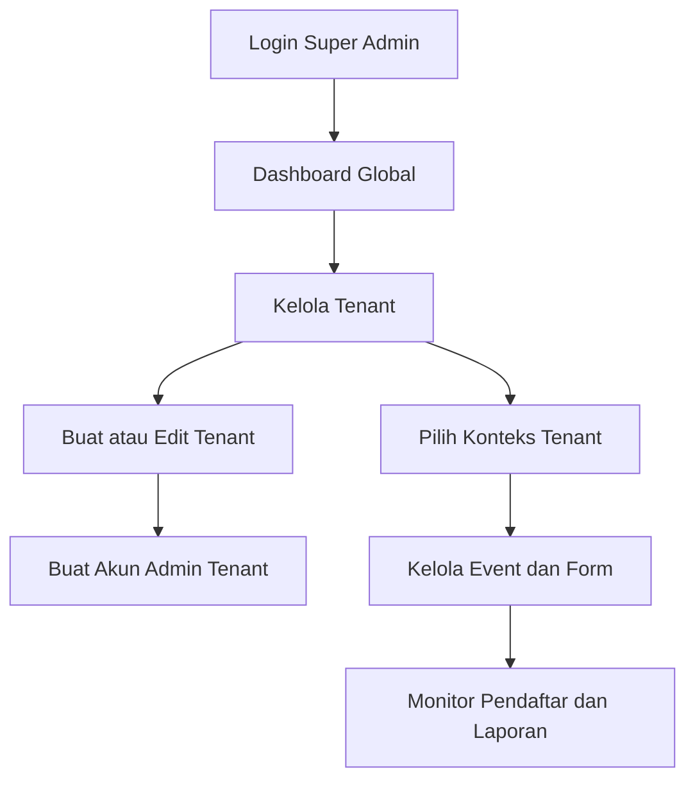
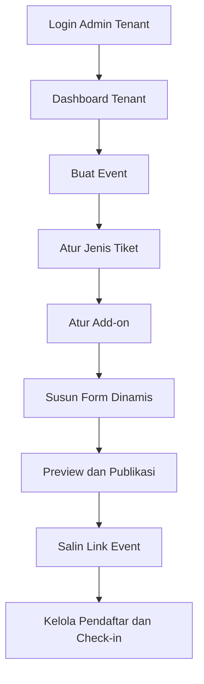
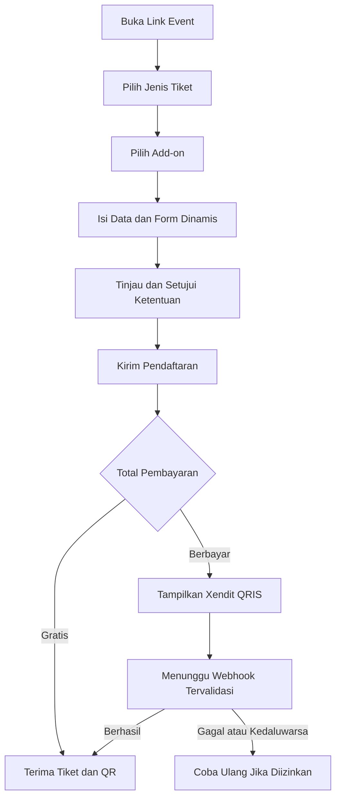
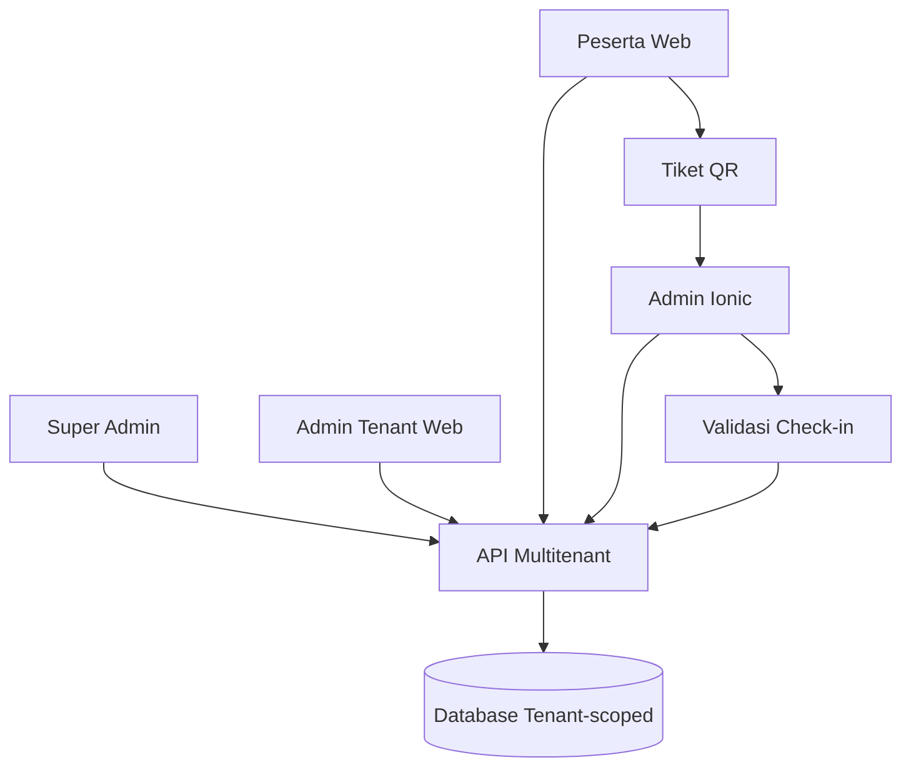

# Prompt Implementasi Frontend Web Ticketing Multitenant

Gunakan prompt berikut untuk membangun frontend aplikasi.

## Prompt

Anda adalah senior frontend engineer. Bangun frontend aplikasi **Web Ticketing Multitenant** yang production-ready, responsif, mudah dikembangkan, dan terintegrasi dengan backend REST API.

### 1. Arsitektur dan teknologi

- Gunakan monorepo dengan struktur:
  - `apps/web`: Next.js App Router + TypeScript.
  - `apps/mobile`: Ionic React + Capacitor + TypeScript.
  - `packages/ui`: komponen UI yang dapat digunakan bersama jika kompatibel.
  - `packages/types`: tipe request, response, enum, dan schema validasi bersama.
  - `packages/api_client`: client REST API terpusat.
- Gunakan React agar logika dan tipe dapat dibagi antara Next.js dan Ionic.
- Gunakan Tailwind CSS untuk web dan Ionic Components untuk mobile.
- Gunakan TanStack Query untuk server state, React Hook Form untuk form, dan Zod untuk validasi.
- Seluruh nama file, variabel, route internal, key payload, dan field mengikuti `snake_case` jika terdiri dari lebih dari satu kata, kecuali aturan framework yang wajib berbeda.
- Jangan menaruh business logic inti di komponen halaman. Pisahkan ke service, hook, schema, dan utility.
- Base URL API berasal dari environment variable. Jangan hard-code URL, tenant, role, atau data event.

### 2. Aktor dan hak akses

Implementasikan tiga konteks pengguna:

1. **Super Admin**
   - Login ke panel pusat.
   - Melihat dashboard global.
   - Membuat, mengubah, mengaktifkan, menonaktifkan, dan melihat tenant.
   - Membuat akun Admin Tenant pada tenant tertentu.
   - Membuka konteks tenant yang dipilih untuk melihat atau mengubah event, form dinamis, jenis tiket, add-on, pendaftar, dan laporan.
   - Semua aksi lintas tenant harus menampilkan tenant aktif dengan jelas.

2. **Admin Tenant**
   - Hanya dapat mengakses data tenant miliknya.
   - Membuat dan mengelola event.
   - Mengatur form pendaftaran, jenis tiket, add-on, kuota, publikasi, pendaftar, tiket, dan check-in.
   - Tidak dapat melihat atau mengubah tenant lain.

3. **Peserta/Public User**
   - Tidak perlu login untuk membuka landing page event dan melakukan pendaftaran.
   - Mengisi nama, nomor WhatsApp, dan email sebagai field wajib.
   - Memilih jenis tiket dan add-on.
   - Mengisi field dinamis sesuai konfigurasi event.
   - Mendapat halaman konfirmasi dan tiket dengan QR code setelah pendaftaran berhasil sesuai status yang diberikan backend.

### 3. Route web

Gunakan route minimal berikut:

```text
/login
/super-admin/dashboard
/super-admin/tenants
/super-admin/tenants/new
/super-admin/tenants/[tenant_id]
/super-admin/tenants/[tenant_id]/users
/super-admin/tenants/[tenant_id]/events
/super-admin/tenants/[tenant_id]/payment-settings
/admin/dashboard
/admin/events
/admin/events/new
/admin/events/[event_id]
/admin/events/[event_id]/form-builder
/admin/events/[event_id]/ticket-types
/admin/events/[event_id]/add-ons
/admin/events/[event_id]/registrations
/admin/events/[event_id]/check-in
/admin/reports
/e/[tenant_slug]/[event_slug]
/e/[tenant_slug]/[event_slug]/register
/e/[tenant_slug]/[event_slug]/payment/[registration_code]
/e/[tenant_slug]/[event_slug]/payment/[registration_code]/status
/ticket/[ticket_code]
```

Setelah event berhasil dibuat, tampilkan link default publik:

```text
{public_web_url}/e/{tenant_slug}/{event_slug}
```

Sediakan tombol salin link, buka halaman publik, bagikan ke WhatsApp, dan generate QR menuju link event.

### 4. Halaman Super Admin

#### Dashboard global

Tampilkan jumlah tenant aktif, total event, total pendaftar, total tiket diterbitkan, dan total check-in. Sediakan filter tanggal dan tenant.

#### Manajemen tenant

Form tenant minimal memuat:

- nama tenant;
- slug unik;
- logo;
- warna utama;
- email;
- nomor WhatsApp;
- alamat;
- status aktif/nonaktif;
- custom domain opsional;
- batas event dan pengguna opsional.

#### Akun Admin Tenant

Super Admin memilih tenant lalu membuat akun dengan nama, email, nomor WhatsApp, role, password sementara, dan status. Tampilkan aksi reset password, nonaktifkan akun, dan pindahkan akun hanya melalui dialog konfirmasi.

### 5. Halaman Admin Tenant dan manajemen event

Form event minimal memuat:

- nama event;
- slug;
- deskripsi singkat dan lengkap;
- banner;
- lokasi fisik atau online;
- tanggal dan waktu mulai/selesai;
- zona waktu;
- periode pendaftaran;
- kapasitas total;
- informasi penyelenggara;
- syarat dan ketentuan;
- kebijakan privasi;
- status `draft`, `published`, `closed`, atau `archived`.

Sediakan tampilan stepper:

1. Informasi event.
2. Jenis tiket.
3. Add-on.
4. Form pendaftaran.
5. Preview.
6. Publikasi.

Pada pengaturan pembayaran event, sediakan:

- event gratis atau berbayar;
- Xendit sebagai payment gateway;
- QRIS sebagai metode utama dan pilihan default;
- durasi kedaluwarsa pembayaran yang tidak melebihi batas channel Xendit;
- opsi mengaktifkan metode pembayaran cadangan di masa depan tanpa mengubah flow QRIS;
- pesan instruksi pembayaran dan kebijakan tiket jika pembayaran kedaluwarsa.

### 6. Jenis tiket dinamis

Admin dapat menambah lebih dari satu jenis tiket, misalnya Reguler, VIP, Undangan, atau Early Bird. Setiap jenis tiket mendukung:

- nama dan deskripsi;
- harga, dengan nilai `0` untuk gratis;
- kuota;
- minimal dan maksimal pembelian;
- periode penjualan;
- status aktif;
- urutan tampilan;
- visibilitas publik atau menggunakan kode akses;
- field tambahan khusus jenis tiket bila diperlukan.

Frontend harus menampilkan sisa kuota dari backend dan tidak menghitung kuota final hanya di sisi klien.

### 7. Add-on dinamis

Admin dapat membuat add-on seperti kaos, konsumsi, parkir, merchandise, atau donasi. Setiap add-on mendukung:

- nama dan deskripsi;
- harga;
- kuota opsional;
- wajib atau opsional;
- pilihan tunggal atau banyak;
- jumlah minimal dan maksimal;
- ketergantungan pada jenis tiket tertentu;
- urutan tampilan;
- status aktif.

Contoh kaos dibuat sebagai add-on `Kaos Event` dengan opsi dinamis `S`, `M`, `L`, `XL`, dan `XXL`, masing-masing dapat mempunyai kuota dan tambahan harga.

### 8. Form builder dinamis

Field bawaan yang selalu wajib dan tidak dapat dihapus:

- `full_name`;
- `whatsapp_number`;
- `email`.

Admin Tenant dan Super Admin dalam konteks tenant dapat menambah, mengubah, mengurutkan dengan drag-and-drop, menonaktifkan, dan menghapus field tambahan. Dukung tipe:

- teks pendek;
- teks panjang;
- angka;
- email;
- nomor telepon;
- tanggal;
- waktu;
- dropdown;
- radio;
- checkbox tunggal;
- checkbox banyak;
- upload file;
- persetujuan/consent;
- heading dan teks informasi.

Setiap field mendukung label, key unik `snake_case`, placeholder, help text, wajib/tidak, pilihan, nilai awal, aturan validasi, urutan, conditional logic, dan keterkaitan dengan jenis tiket. Sediakan preview desktop dan mobile. Jangan menggunakan `eval` untuk conditional logic.

Contoh conditional logic: tampilkan field `shirt_size` hanya jika peserta memilih add-on `event_shirt`.

### 9. Flow pendaftaran publik

Gunakan wizard yang tetap nyaman di mobile:

1. Buka halaman event dan cek status pendaftaran.
2. Pilih jenis tiket.
3. Pilih add-on serta opsi turunannya.
4. Isi data wajib dan field dinamis.
5. Tinjau ringkasan data dan biaya.
6. Setujui syarat dan kebijakan privasi.
7. Kirim pendaftaran dengan idempotency key.
8. Jika total `0`, tampilkan hasil pendaftaran berhasil dan tiket.
9. Jika total lebih dari `0`, backend membuat Xendit Payment Request QRIS dan mengembalikan data QR yang aman untuk ditampilkan.
10. Tampilkan halaman pembayaran QRIS dengan nominal, batas waktu, countdown, QR code, tombol salin kode bila tersedia, instruksi scan, dan tombol `Saya Sudah Bayar` untuk memeriksa status ke backend.
11. Pantau status melalui polling terkontrol atau server event dari backend; frontend tidak boleh menganggap redirect atau klik pengguna sebagai bukti pembayaran.
12. Tampilkan hasil berdasarkan status backend: menunggu pembayaran, sedang diproses, berhasil, kedaluwarsa, atau gagal.
13. Jika webhook pembayaran telah dikonfirmasi backend, arahkan ke tiket dan tampilkan ticket code, QR tiket, detail event, serta tombol unduh atau bagikan.

Normalisasi nomor WhatsApp Indonesia untuk UX, tetapi backend tetap menjadi sumber validasi final. Hindari pendaftaran ganda akibat double-click. Jangan menyimpan data pribadi sensitif ke local storage.

### 10. Pembayaran Xendit QRIS

- Gunakan QRIS sebagai metode pembayaran yang langsung dipilih untuk transaksi berbayar.
- Frontend hanya memanggil endpoint pembayaran milik backend; API secret Xendit dan callback token tidak boleh berada di browser, bundle Next.js, Ionic, environment publik, ataupun local storage.
- Render QR berdasarkan action pembayaran yang sudah dinormalisasi backend menjadi `qr_string` atau `qr_image_url`. Jangan mengakses respons mentah Xendit langsung dari komponen.
- Tampilkan merchant/event, `registration_code`, nominal IDR, biaya jika ada, status, dan `expires_at`.
- QR pembayaran dan QR tiket harus dibedakan secara visual dan tekstual.
- Pada mobile satu perangkat, sediakan tombol simpan gambar QR dan instruksi membuka QR tersebut dari galeri aplikasi bank/e-wallet jika didukung.
- Status sukses hanya berasal dari backend setelah webhook Xendit tervalidasi. Return URL hanya digunakan untuk UX kembali ke halaman status.
- Jika status masih `pending`, lanjutkan polling dengan interval bertahap dan berhenti saat halaman tidak aktif, status final, atau melewati `expires_at`.
- Jika pembayaran kedaluwarsa, tampilkan tombol membuat ulang pembayaran jika registration masih memenuhi aturan kuota dan backend mengizinkannya.
- Jika webhook datang ketika halaman tertutup, peserta tetap dapat membuka kembali halaman status menggunakan link aman.
- Halaman Admin Tenant menampilkan status Xendit yang dimapping ke status internal, payment request ID yang dimasking, waktu bayar, nominal, dan tombol rekonsiliasi sesuai permission.

Super Admin dapat mengatur integrasi Xendit per tenant atau memakai akun platform default. Field secret hanya dapat dikirim ke backend, tidak pernah dibaca kembali dalam bentuk asli. UI hanya menampilkan status konfigurasi, environment `test`/`live`, `business_id`, waktu verifikasi terakhir, dan tombol test connection.

### 11. Aplikasi Ionic

Bangun aplikasi Ionic yang memakai backend dan tipe data yang sama. Minimal menyediakan:

- login Super Admin atau Admin Tenant;
- pemilihan tenant bagi Super Admin;
- daftar event;
- ringkasan pendaftar;
- pencarian tiket;
- scan QR menggunakan Capacitor Camera/Barcode Scanner;
- konfirmasi check-in dan pembatalan check-in sesuai izin;
- riwayat pemindaian;
- mode offline terbatas untuk daftar tiket yang sudah disinkronkan, lalu sinkronisasi aman saat online;
- halaman tiket peserta atau deep link dari web sebagai fitur opsional.

Pada check-in, tampilkan hasil berbeda untuk tiket valid, sudah digunakan, dibatalkan, event salah, tenant salah, dan tidak ditemukan. Konflik sinkronisasi offline harus diputuskan backend dan ditampilkan jelas.

### 12. UX, keamanan, dan kualitas

- Terapkan route guard berdasarkan session dan role, tetapi jangan menganggap guard frontend sebagai pengamanan utama.
- Sembunyikan menu tanpa izin dan tangani respons `401`, `403`, `404`, `409`, serta `422` secara jelas.
- Semua form memiliki loading, empty, validation, error, success, dan unsaved changes state.
- Gunakan accessible label, keyboard navigation, focus state, kontras warna, dan responsive layout.
- Terapkan pagination/filter server-side untuk tenant, event, pendaftar, dan tiket.
- Tabel pembayaran memiliki filter tenant, event, status, tanggal, dan `registration_code`, serta tidak pernah menampilkan API key atau callback token.
- Masking data pribadi pada tabel bila tidak diperlukan penuh.
- Gunakan toast untuk aksi ringan dan dialog konfirmasi untuk aksi berisiko.
- Buat error boundary, skeleton loading, dan halaman not found.

### 13. Kontrak API yang diharapkan

Client API harus modular untuk resource:

```text
auth
tenants
users
events
ticket_types
add_ons
form_fields
registrations
payments
tickets
check_ins
reports
uploads
```

Gunakan response envelope konsisten:

```json
{
  "success": true,
  "message": "Operation completed",
  "data": {},
  "meta": {
    "page": 1,
    "per_page": 20,
    "total": 0
  }
}
```

### 14. Pengujian dan hasil akhir

- Buat unit test untuk schema, formatter, conditional form, dan permission helper.
- Buat component test untuk form builder, ticket selector, add-on selector, dan scanner result.
- Buat end-to-end test untuk login, membuat tenant, konfigurasi Xendit test mode, membuat Admin Tenant, membuat event, publikasi, pendaftaran publik, menampilkan QRIS, menerima perubahan status pembayaran dari backend, penerbitan tiket, dan check-in.
- Sertakan `.env.example`, README setup, struktur folder, seed/mock development, serta instruksi menjalankan web dan Ionic.
- Jangan menggunakan data dummy permanen di production path.
- Hasil akhir harus dapat dijalankan, memiliki lint dan type-check tanpa error, serta tidak meninggalkan TODO pada flow utama.

## Flowchart Frontend dan Aktor

### Super Admin



### Admin Tenant



### Peserta



### Flow Beririsan Web dan Ionic


